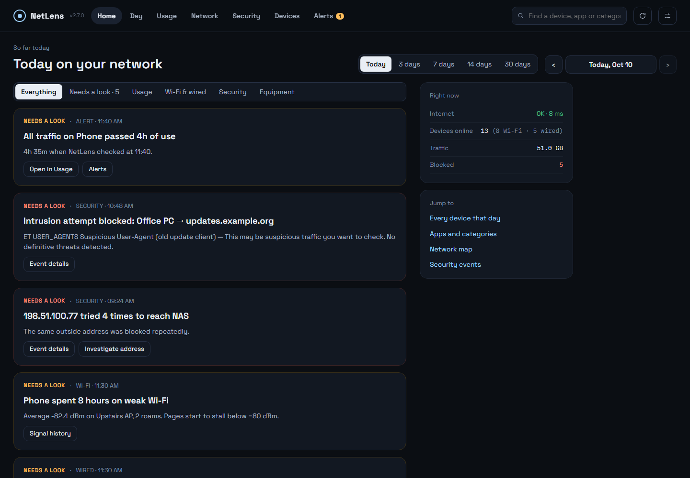
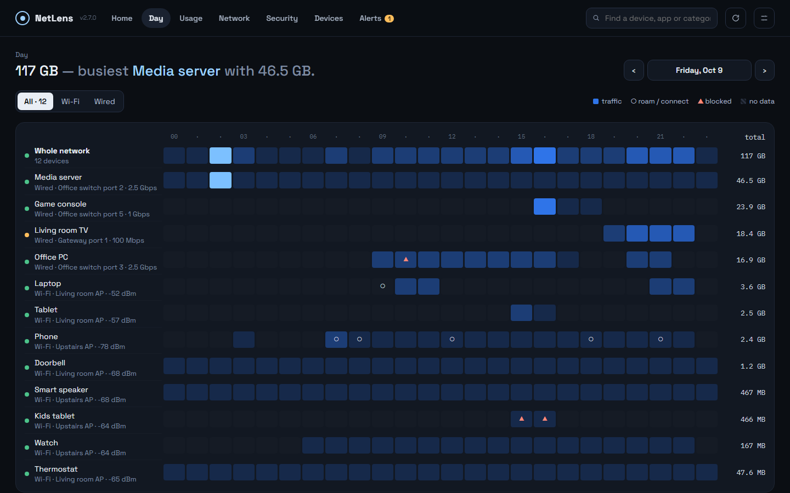
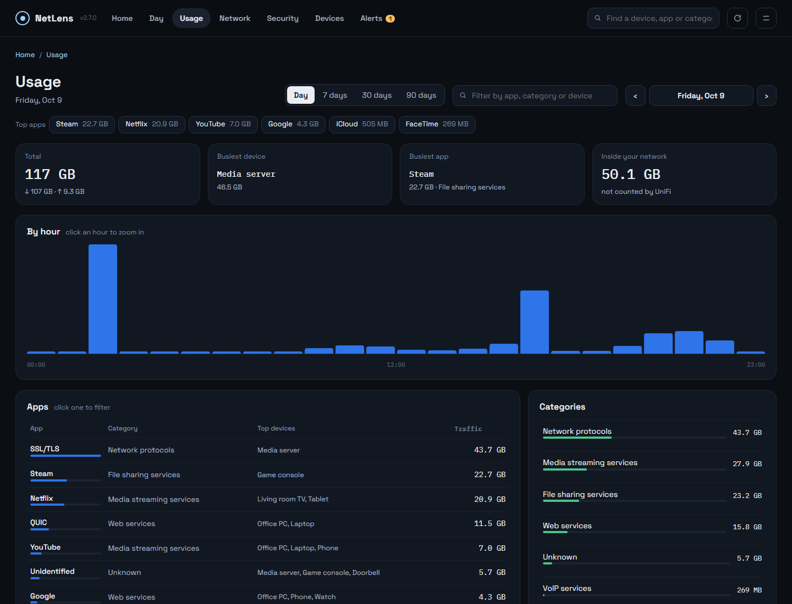
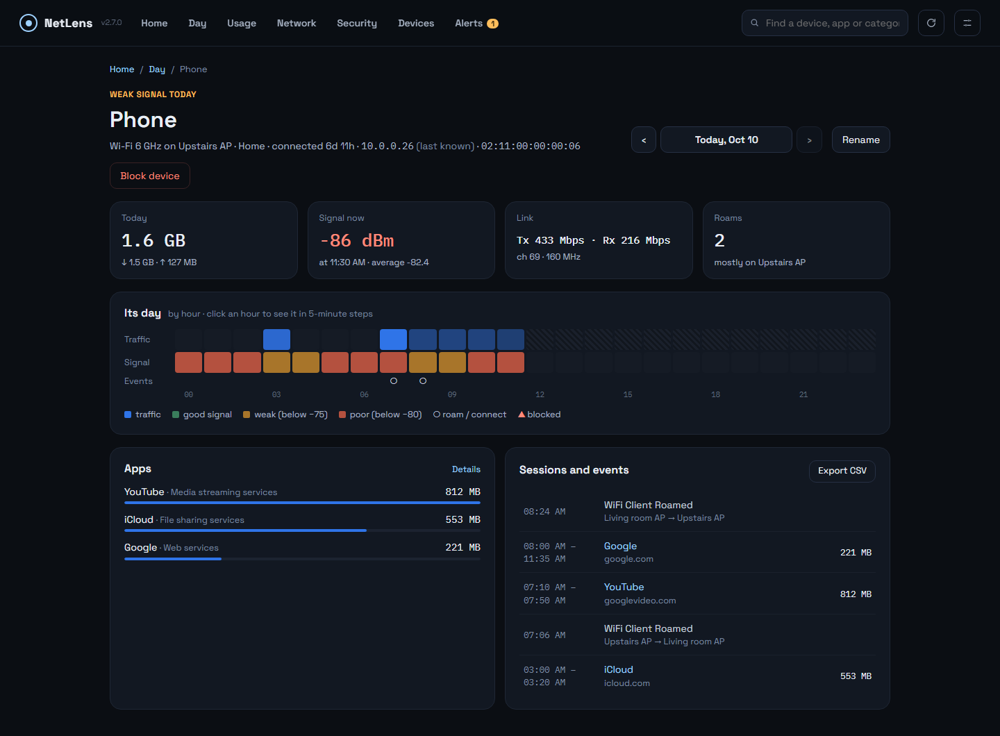
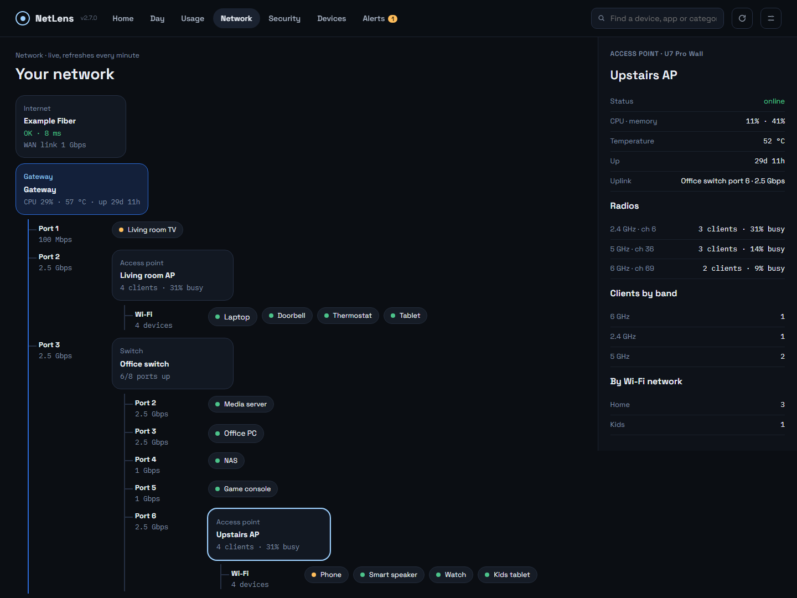
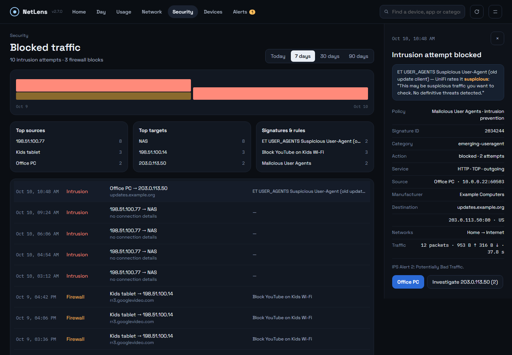
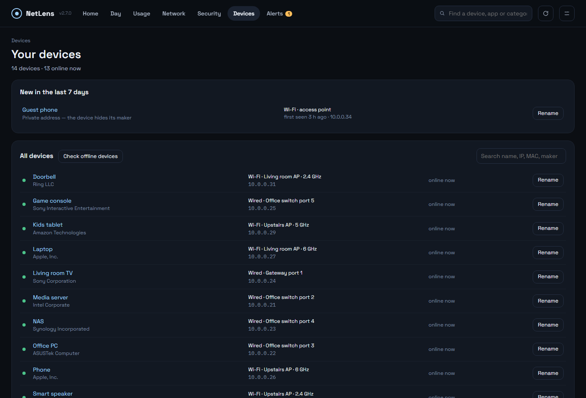
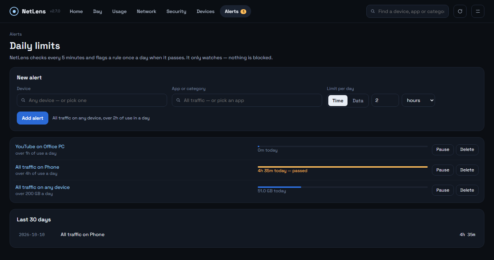

<p align="center"></p>

# NetLens

**A dashboard for UniFi networks.**

Self-hosted, it shows **who used how much, of what, and when**,
how good each device's **Wi-Fi** is, how your **access points, switches and gateway** are doing,
and what your firewall and intrusion prevention **blocked** — and it keeps that history,
which UniFi itself deletes after a day or a week.

> Not affiliated with, endorsed by, or sponsored by Ubiquiti Inc. UniFi is a trademark of Ubiquiti Inc.

## Screenshots

| | |
| --- | --- |
|  |  |
| **Home** — findings in plain language, alerts on top | **Day** — every device by hour |
|  |  |
| **Usage** — top apps, search by app, category or device | **Device** — its day, apps, sessions and events |
|  |  |
| **Network** — live map, access point selected | **Security** — blocked intrusion with its full record |
|  |  |
| **Devices** — new devices, maker, switch port or access point, rename | **Alerts** — daily limits per app and device |

<sub>Screenshots use a made-up demo network, not real data.</sub>

## Features

- **Home** — what happened today, in plain language: the day's big transfers, devices on weak
  Wi-Fi or slow wired links, blocked intrusions and firewall hits, repeat offenders, new
  devices, equipment problems — each linking to the details.
- **Day** — every device as a row, the day's hours as columns: when each device was busy, when it
  roamed or reconnected, when something was blocked. Click any hour to see it in 5-minute steps.
- **Network** — a live map: internet → gateway → switches and access points → devices. Click an
  access point for its radios and clients, a switch for its ports (speed, PoE, errors).
- **Device** — per device: traffic, Wi-Fi signal or wired link speed, apps, sessions, events,
  connection time, online history, CSV export, block / unblock.
- **Devices** — every device UniFi knows, new ones first: maker, where it connected (switch port
  or access point and band), IP, first and last seen; rename it (saved in UniFi). Offline devices
  are checked on the network every 5 minutes (ping, then common ports, with a MAC check), so a
  device that is on but not using the internet still shows as there.
- **Alerts** — daily limits on time in use or data for an app or category on a device, e.g.
  YouTube on the kids' tablet over 2 hours. Flagged on Home and the Alerts tab; watch only.
- **Security** — intrusion attempts and firewall blocks with the blocked connection's full
  record (IPS signature, policy, both ends, traffic); investigate an outside address; hide noisy
  rules.
- **Usage** — apps, categories and devices for a day, an hour or up to 90 days; one search box
  for an app, category or device, and the top apps one click away. **Every number on
  a screen comes from one source and adds up**; a built-in audit (`npm run audit`) checks every
  day × device × app combination.
- **Local-network traffic** (a media server, a NAS) shown separately — UniFi's counters only
  cover internet traffic.
- **Missing data is marked, never shown as a quiet hour**, and filled from UniFi's daily
  per-device totals where those still exist.
- **History export / import**, an optional syslog listener for ad-block counts.

## Why it runs all the time

UniFi keeps fine-grained data only briefly. On the console this was built against:

| Data | Kept by UniFi |
| --- | --- |
| 5-minute usage | 24 hours |
| Hourly usage per app | 7 days |
| Connection records (flows) | a count cap — 500,000 on a UCG Fiber with storage, ≈ 4 days on a busy network |
| Daily per-device totals, System Log | 90 days |
| Wi-Fi signal, equipment health | only "right now" |

NetLens samples the console every 5 minutes and keeps its own copy (usage 30 days, events and
Wi-Fi/equipment samples 90 days, daily totals a year), so history survives.

## Requirements

- A **UniFi OS console** (UDM, UDM Pro/SE, UCG Ultra/Max/Fiber, UDR, Cloud Key Gen2+). Built and
  tested on a UCG Fiber running UniFi Network 10.6.
- A **local API key**: UniFi Network → Settings → Control Plane → Integrations → *Create API Key*.
  It is shown only once — copy it then.
- Docker (Unraid, Synology, any Linux host). The container must be able to reach the console.

## Install

### Unraid

Search **NetLens** in Community Applications, or add the template from
[`unraid/netlens.xml`](unraid/netlens.xml). Start it and open the web UI.

### Docker

```bash
docker run -d --name netlens --restart unless-stopped \
  -p 3780:3780 \
  -v /path/to/netlens-data:/data \
  gjergjk/netlens:latest
```

Then open `http://<host>:3780`. Images: `gjergjk/netlens` (Docker Hub) and
`ghcr.io/georgeal78/netlens`, for amd64 and arm64.

### Docker Compose

See [`docker-compose.yml`](docker-compose.yml).

## First start

Open the web UI. A short setup asks for:

- your **UniFi console** address and the **API key**,
- the **site** (normally `default`) and your **timezone**,
- a **login password** — recommended, because the dashboard can block devices (leave both
  fields empty to run without one).

It checks the connection before finishing. Everything can be changed later in **Settings** (the
icon top right), including the password; **Log out** is there too. All data lives in `/data`.

**Forgot the password?** Start the container once with `NETLENS_RESET_PASSWORD=1`, set a new
password in the browser, then remove the variable.

### Backup, restore and moving history

**Settings → History**: *Export history* downloads one file with everything saved — usage,
connection records, network events, Wi-Fi and equipment samples. *Import history…* merges such
a file into this installation: days it does not have are added, a day it has is replaced only
by a fuller copy, and events and samples are added where missing. Use it to move to a new
server, to restore a backup, or to bring in history from another installation. Settings, the
API key and the password are never in the file. Days older than the 30 days of usage history
are skipped.

### Optional environment variables

For scripted installs these seed empty settings on the very first start; after that the
web UI is in charge: `UNIFI_HOST`, `UNIFI_API_KEY`, `UNIFI_SITE`, `UNIFI_SITE_ID`, `TZ`,
`SIEM_PORT`, `UI_PASSWORD`. `UNIFI_PORT` (default `3780`) is the port inside the container.

### Blocked-ad counts (optional)

Network events come from UniFi's System Log automatically. Only ad-block hits need syslog. The
container listens on port `5514` (TCP and UDP) by default: publish that port and point UniFi at
this server (CyberSecure → Traffic Logging → Activity Logging → SIEM Server). Clear the port in
Settings to turn the listener off.

## Security

- **The login password is required** on first start: the dashboard can block devices.
- It is meant for your LAN. Do not expose it to the internet; use a VPN to reach it remotely.
- The API key never leaves the server: the UI only learns whether one is stored.
- Passwords are stored as scrypt hashes; sessions are signed cookies; five wrong passwords lock
  that address out for five minutes. Plain HTTP — fine on a home LAN, not across untrusted networks.

## Development

```bash
npm install
npm run dev        # API on :3780, UI with hot reload on :5173
npm run build      # production UI into dist/
npm start          # server + built UI on :3780
npm run audit      # every screen must add up (needs a running server)
```

Node 24+. Data goes to `./database` unless `UNIFI_DATABASE_DIR` is set.

## Credits

- Wi-Fi presence definitions (dwell time, favourite AP, presence pattern) follow
  [unifi-toolkit](https://github.com/Crosstalk-Solutions/unifi-toolkit)'s Wi-Fi Stalker (MIT);
  the choice of client and equipment metrics was inspired by
  [Unpoller](https://github.com/unpoller/unpoller) (MIT). Ideas, not code.
- [Public Suffix List](https://publicsuffix.org) (MPL-2.0).
- IP address data powered by [IPinfo](https://ipinfo.io), licensed CC BY-SA 4.0.

See [NOTICE](NOTICE).

## Changelog

See [CHANGELOG.md](CHANGELOG.md).

## License

[GPL-3.0](LICENSE).
